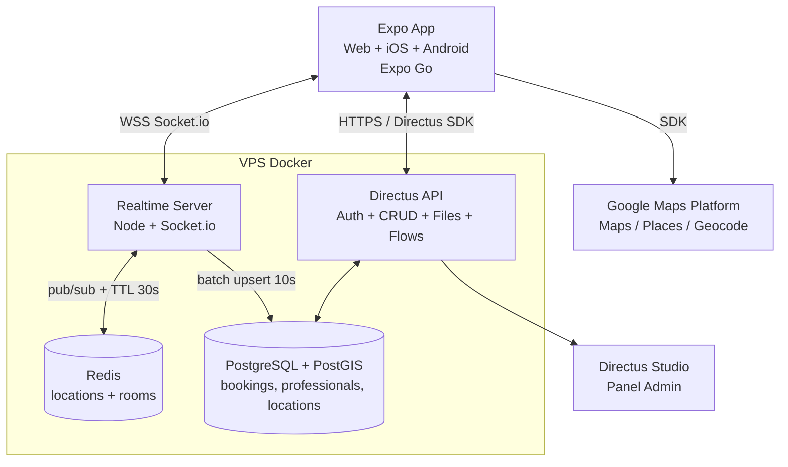

# LOOKIFY — Roadmap por Fases

> **Nombre:** Lookify | **MVP:** Auth + Mapa + Reserva por cercanía
> **Stack:** Expo Router (Web + Móvil con Expo Go) + Google Maps + Socket.io + Directus Self-hosted Docker (PostgreSQL + PostGIS + Redis)

---

## 1. Visión y Alcance

### 1.1 Qué es
Marketplace on-demand que conecta **clientes** con **profesionales de belleza** cercanos (uñas, maquillaje, peluquería, barbería, skincare, etc.). El profesional es el "conductor", el servicio de belleza es el "viaje".

### 1.2 Alcance MVP (Fases 0-7)
INCLUIDO:
- Auth con roles `client`, `professional`, `admin`
- Perfiles + catálogo de servicios
- Geolocalización en vivo (profesionales online en mapa)
- Búsqueda por cercanía (radio 3 / 5 / 10 km)
- Reserva on-demand: `pending → accepted / rejected → in_progress → completed / cancelled`
- Tracking en vivo de la reserva vía Socket
- Panel admin con Directus Studio
- Web + Móvil desde un solo codebase Expo, probado en Expo Go

NO MVP (post-MVP):
- Pagos online (Stripe / MercadoPago), chat interno, reviews avanzadas, promociones, suscripciones, multidioma, facturación.

### 1.3 Roles
| Rol | Puede |
|-----|-------|
| `client` | Ver mapa, buscar servicios cercanos, reservar, ver estado de su reserva |
| `professional` | Publicar ubicación si está online, recibir solicitudes, aceptar/rechazar, actualizar estado |
| `admin` | Todo, moderar, ver métricas en Directus Studio |

---

## 2. Stack Técnico Cerrado

| Capa | Tecnología |
|------|------------|
| App Web + Móvil | React Native + Expo Router + TypeScript + NativeWind, `expo-location`, `react-native-maps` (provider Google) |
| Mapas | Google Maps Platform: Maps SDK, Places Autocomplete, Geocoding, Distance Matrix |
| Realtime | Node.js + Socket.io (servidor aparte), Redis Pub/Sub + rooms por zona |
| Backend / DB | Directus Self-hosted Docker + PostgreSQL 16 + PostGIS + Redis 7 |
| Auth / Files | Directus Auth (email/password + refresh), Directus Files (avatars, portafolio) |
| Deploy | VPS (Coolify / Railway / Render) para Directus + realtime-server, Vercel para web `expo export -p web`, EAS para APK/IPA |
| Test en dev | Expo Go (QR con `npx expo start`) |

Por qué separado Directus + Socket: Directus es excelente para CRUD/Auth/permisos, pero no está hecho para 1 mensaje GPS cada 5s de cientos de usuarios. El realtime-server absorbe esa carga y solo hace batch-write a PostGIS.

---

## 3. Diagrama de Arquitectura



### 3.1 Flujo on-demand (camino feliz)
1. Profesional pone `is_online=true` → app pide GPS cada 8s → emite `location:update {lat,lng}` al Socket.
2. Socket valida rate-limit → guarda en Redis `geo:prof:{id}` con TTL 30s → join a room `zone:{geohash5}`.
3. Cada 10s worker hace batch upsert a `professional_locations (geom Point 4326)`.
4. Cliente abre mapa → app pide `GET /items/beauty_professionals?filter=cercanos` o query geo al realtime-server → muestra pines <10km.
5. Cliente reserva → `POST /items/bookings` status `pending` → Socket emite `booking:new` solo al profesional (room `prof:{id}`).
6. Profesional acepta → `PATCH /items/bookings` → Socket emite `booking:status` al cliente (room `booking:{id}`).
7. En curso → tracking en vivo del profesional hasta `completed`.

### 3.2 Anti-saturación (para que no se caiga en prod)
- Throttle GPS: solo si se movió >20m o cada 8s, nunca cada 1s.
- Rate-limit Socket: max 1 msg / 5s por cliente, ban temporal si abusa.
- Rooms por geohash, no broadcast global.
- Redis como buffer, Postgres solo recibe batch, no 1 write por ping.
- Índice GiST en `geom`, query con `ST_DWithin(geom, ST_MakePoint(lng,lat)::geography, radio_m)`.
- Paginación (limit 20) y TTL: si un profesional no reporta en 30s se marca offline.

---

## 4. Estructura Monorepo Objetivo

```
/
  roadmap.md
  docker-compose.yml          # directus + postgres-postgis + redis + realtime-server
  .env.example
  directus/
    snapshots/                # schema versionado de Directus
    flows/                    # validación anti-doble-reserva
  apps/
    mobile-web/               # Expo Router (web + móvil)
      app/
        (auth)/login.tsx
        (client)/map.tsx
        (client)/booking/[id].tsx
        (pro)/online.tsx
        (pro)/requests.tsx
      lib/
        directus.ts           # cliente Directus SDK
        socket.ts             # cliente Socket.io
        location.ts           # wrapper expo-location + throttle
    realtime-server/
      src/index.ts            # Socket.io + Redis + batch PostGIS
```

---

## 5. Modelo de Datos Directus + PostGIS

Colecciones Directus (crear en Studio y exportar snapshot):

- `beauty_professionals`: `id (uuid, pk)`, `user (FK directus_users, 1-1)`, `display_name`, `bio`, `avatar (file)`, `is_online (bool)`, `rating_avg (float)`, `geohash (string)`, `current_lat/lng (float, cache)`
- `beauty_services`: `id`, `name`, `category`, `price_base`, `duration_min`, `is_active`
- `professional_services` (M2M): `professional_id`, `service_id`, `price_override`
- `professional_locations`: `professional_id (pk, FK)`, `geom (geometry Point 4326)`, `updated_at`
- `bookings`: `id`, `client (FK users)`, `professional (FK)`, `service (FK)`, `status (pending/accepted/rejected/in_progress/completed/cancelled)`, `price_snapshot`, `address_text`, `lat/lng`, `scheduled_at`, `created_at`
- `availability_slots` (opcional MVP): `professional_id`, `weekday`, `start`, `end`

SQL clave a ejecutar una vez en Postgres:

```sql
CREATE EXTENSION IF NOT EXISTS postgis;
-- tabla de ubicaciones (si no la crea Directus con tipo geography)
ALTER TABLE professional_locations ADD COLUMN IF NOT EXISTS geom geometry(Point, 4326);
CREATE INDEX IF NOT EXISTS idx_prof_loc_geom ON professional_locations USING GIST (geom);
-- buscar cercanos en X metros
-- SELECT * FROM professional_locations
-- WHERE ST_DWithin(geom::geography, ST_MakePoint(-99.16, 19.43)::geography, 5000);
```

Permisos Directus:
- `client`: read `beauty_professionals (is_online=true)`, `beauty_services`, create/read own `bookings`.
- `professional`: read/update own `beauty_professionals`, read/update own `bookings`, update own `professional_locations`.
- `admin`: full.

Flow Directus `validate-booking`: al crear `bookings`, si profesional tiene otro booking en `pending/accepted/in_progress` solapado → denegar.

---

## 6. Fases

### FASE 0 — Fundaciones (0.5 - 1 sem)
**Objetivo:** repo corre en local y en Expo Go.
- [ ] `npx create-expo-app apps/mobile-web --template tabs@latest` + TS + NativeWind
- [ ] Crear `docker-compose.yml` base + `.env.example`
- [ ] Definir convenciones: ramas, commits, envs (`EXPO_PUBLIC_DIRECTUS_URL`, `EXPO_PUBLIC_SOCKET_URL`, `EXPO_PUBLIC_GOOGLE_MAPS_KEY`)
- [ ] `npx expo start` → QR funciona en Expo Go + `w` abre web
**DONE:** app blank abre en Expo Go y web sin errores.

### FASE 1 — Directus Self-hosted + DB Geo (1 sem)
**Objetivo:** backend vivo con geo.
- [ ] `docker-compose.yml`: `postgis/postgis:16-3.4`, `redis:7`, `directus/directus:latest`
- [ ] Levantar: `docker compose up -d`, crear admin, configurar `EXTENSION postgis`
- [ ] Crear colecciones del §5 en Studio → `snapshot` a `directus/snapshots/`
- [ ] Crear roles + permisos + Flow anti-solape
- [ ] Backup diario Postgres (cron + `pg_dump`)
**DONE:** Studio login OK, CRUD de servicios OK, índice GiST creado.

`docker-compose.yml` mínimo:
```yaml
services:
  postgres:
    image: postgis/postgis:16-3.4
    environment:
      POSTGRES_DB: lookify
      POSTGRES_USER: lookify
      POSTGRES_PASSWORD: lookify_pwd
    volumes: [pgdata:/var/lib/postgresql/data]
  redis:
    image: redis:7
  directus:
    image: directus/directus:latest
    ports: ["8055:8055"]
    depends_on: [postgres, redis]
    environment:
      DB_CLIENT: pg
      DB_HOST: postgres
      DB_DATABASE: lookify
      DB_USER: lookify
      DB_PASSWORD: lookify_pwd
      CACHE_ENABLED: "true"
      CACHE_STORE: redis
      CACHE_REDIS: redis://redis:6379
      KEY: supersecret-key-cambiar
      SECRET: supersecret-secret-cambiar
volumes: { pgdata: {} }
```

### FASE 2 — Auth + Perfiles (1 sem)
**Objetivo:** login por rol.
- [ ] `lib/directus.ts` con `@directus/sdk`, login, refresh, persist con SecureStore
- [ ] Pantallas `app/(auth)/login`, `register`, onboarding selección rol
- [ ] Crear `beauty_professionals` al registrarse como pro + upload avatar a Directus Files
- [ ] Guards Expo Router: `(client)` solo client, `(pro)` solo professional
**DONE:** 2 usuarios (cliente + pro) logueados en 2 Expo Go distintos.

### FASE 3 — Geolocalización Base (1 sem, núcleo MVP)
**Objetivo:** ver profesionales cercanos en mapa Google.
- [ ] Permisos `expo-location` + `lib/location.ts` con throttle (8s / 20m)
- [ ] `react-native-maps` con `provider={PROVIDER_GOOGLE}`, API key por plataforma
- [ ] Realtime-server mínimo: acepta `location:update`, guarda Redis, batch a PostGIS
- [ ] Cliente consulta cercanos: `GET /realtime/nearby?lat=&lng=&radius=5000&service_id=`
- [ ] Pines + bottom-sheet con precio/distancia (Distance Matrix o haversine local)
**DONE:** con pro online, cliente ve pin a <10km en <1.5s.

Eventos Socket Fase 3:
- `prof:online {professional_id}` / `prof:offline`
- `location:update {lat,lng,ts}` (pro → server, rate-limited)
- `zone:update [{professional_id,lat,lng}]` (server → clientes de la zona)

### FASE 4 — Reserva On-Demand (1 sem, núcleo MVP)
**Objetivo:** reserva E2E sin pagos.
- [ ] UI cliente: detalle servicio → elegir hora/address (Places Autocomplete) → confirmar → `POST /items/bookings`
- [ ] UI pro: lista `requests` (bookings pending) → aceptar/rechazar
- [ ] Socket rooms: `prof:{id}`, `booking:{id}`; eventos `booking:new`, `booking:status`
- [ ] Máquina de estados en cliente + pro, bloqueo doble-aceptación (Flow + check optimista)
**DONE:** reserva completa pending→accepted→completed probada con 2 teléfonos.

### FASE 5 — Realtime Tracking + Robustez Expo Go (0.5 sem)
**Objetivo:** tracking vivo estable.
- [ ] Al `accepted`, cliente hace join a `booking:{id}`, pro emite ubicación solo en esa room
- [ ] Reconexión automática Socket + fallback polling Directus cada 15s si WSS falla en Expo Go
- [ ] Indicador `is_online` con heartbeat; si Redis TTL expira → offline
**DONE:** tracking 5 min sin desconexión, reconecta al perder red.

### FASE 6 — Anti-saturación + Calidad Prod (0.5 sem)
- [ ] Rate-limit, validación payloads, CORS estricto, API key Google restringida por bundleId/dominio
- [ ] Índices, `limit 20`, debounce búsqueda, imágenes Directus con `?fit=cover&width=400`
- [ ] Logs (pino), healthcheck `/health`, test carga: 100 clientes simulados con k6 o script node
**DONE:** p95 geo-query <300ms, sin errores con 100 conexiones Socket.

### FASE 7 — Testing Expo Go + Web + Deploy (0.5 sem)
- [ ] QA en Expo Go (Android+iOS) + web `npx expo export -p web`
- [ ] Deploy VPS: Directus + realtime-server + Postgres + Redis (Coolify/Railway), envs prod, HTTPS
- [ ] Web a Vercel, móvil con EAS Build (APK dev + preview)
- [ ] Checklist: backups, rotación `KEY/SECRET`, restricción keys, Sentry básico
**DONE:** URL web pública + backend prod + QR Expo Go contra prod.

---

## 7. Variables de Entorno

```bash
# .env.example
EXPO_PUBLIC_DIRECTUS_URL=http://localhost:8055
EXPO_PUBLIC_SOCKET_URL=http://localhost:4001
EXPO_PUBLIC_GOOGLE_MAPS_KEY=xxx
# backend
DB_DATABASE=lookify
DB_USER=lookify
DB_PASSWORD=cambiar
KEY=cambiar-key-32chars
SECRET=cambiar-secret-32chars
```

---

## 8. Riesgos y Decisiones
- **Expo Go + Google Maps:** requiere `app.json` con `android.config.googleMaps.apiKey` y `ios.config.googleMapsApiKey`; en Expo Go a veces pide dev-build para mapas custom — fallback: usar `MapView` default si falla.
- **Costos Google:** activar billing con cuota + restricción; alternativa barata post-MVP: Mapbox.
- **Directus realtime nativo:** no usar para GPS, solo para CRUD; todo GPS va por Socket+Redis.
- **Privacidad:** nunca exponer ubicación exacta del cliente a todos, solo al profesional de su booking activo.

---

## 9. Post-MVP (no hacer ahora)
Pagos Stripe/MercadoPago, chat, ratings con fotos, cupones, panel métricas, notificaciones push (Expo Push), multi-ciudad con sharding por geohash.

---

## 10. Definición de Terminado MVP
- [ ] 1 cliente reserva a 1 pro cercano desde mapa en Expo Go
- [ ] Tracking en vivo hasta completado
- [ ] Sin doble-reserva
- [ ] Web y móvil desde mismo código
- [ ] Directus + Socket + Redis corriendo en Docker con snapshot versionado
